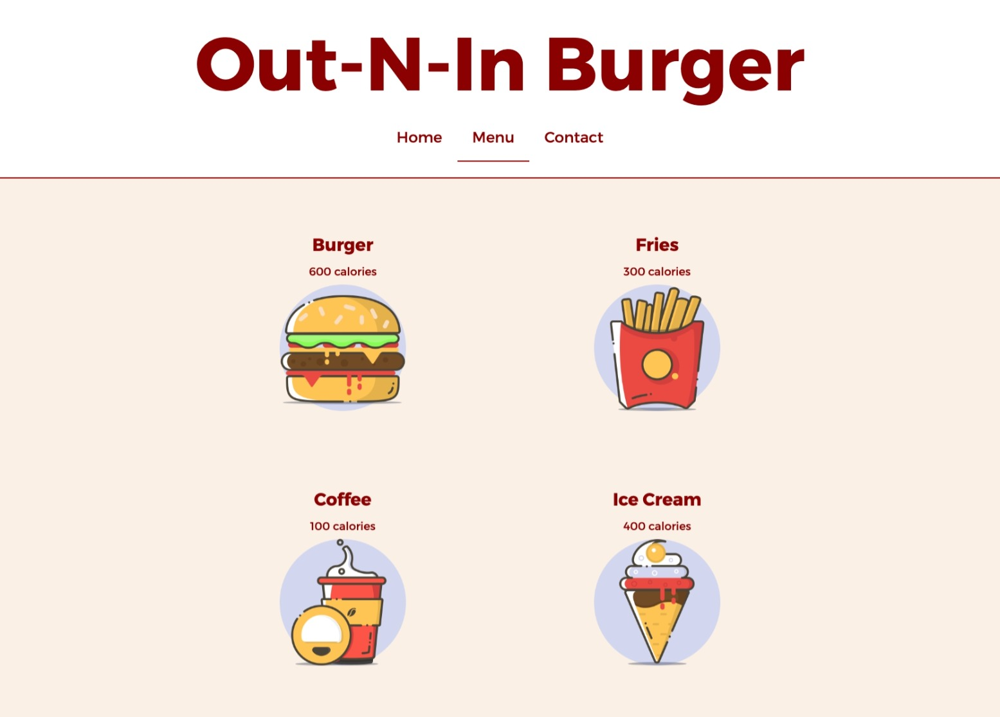

# restaurant-page

This is a solution to the [restaurant page project on The Odin Project](https://www.theodinproject.com/lessons/node-path-javascript-restaurant-page).

## Overview

### Highlights

- Webpack bundling (source map, asset loaders, HtmlWebpackPlugin)
- GitHub Pages deployment from dist folder
- Generating HTML elements in JS
- Tabbed browsing
- ES6 Modules

### Preview

